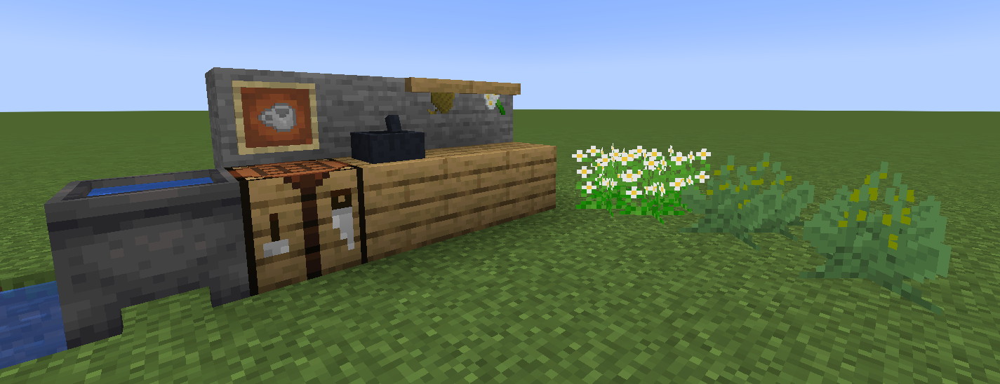
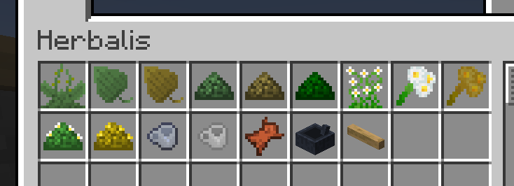
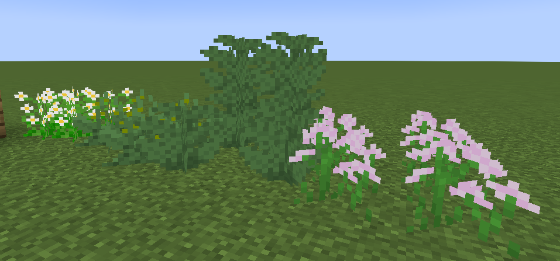
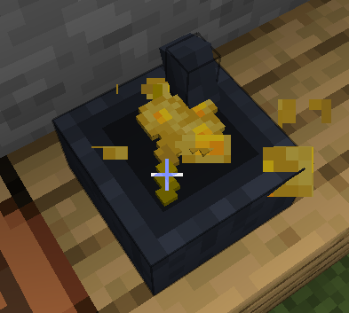
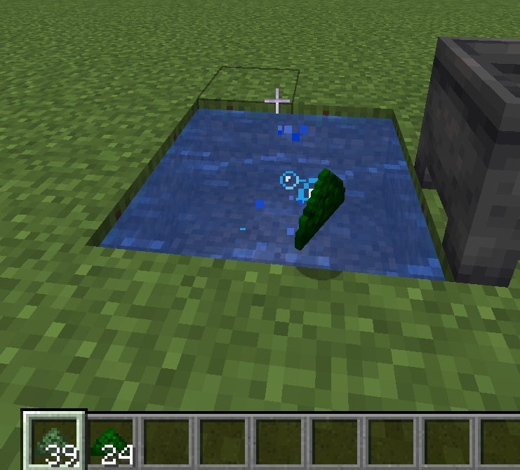

  
  
<i>Learn the art of herbal medicine and historical botany, with real-world logic</i>

This is a mod all about collecting, growing and processing medicinal herbs.

And most of the things which you can do in this mod, you can more than likely do in real life in a forest, for example.

You can find **Plantago**, **crush it** in the mortar, and apply on your skin.

Or find **Chamomile**, **dry it** on the drying rack, crush it, **put it in the basin** with water, and make some healing **tea**.

Or maybe be one of those villager folks and brew some **wine** or dirty **ethanol** in your basement.

This mod is also made to be elegant and feel as an extension of vanilla.

There are some changes affecting existing worlds, so this mod is best played in new worlds/runs.

# Screenshots

# Install

Forge 1.19.2 on [Modrinth](https://modrinth.com/mod/herbalis) (work in progress for now)

We do plan to support later versions or Fabric.

You can freely use this mod in any modpack, with proper credit, of course.
