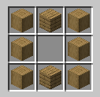

# Machines

the apothecary lab relies on a series of functional blocks that transform raw materials into medical-grade chemicals. these machines prioritize physical interaction and world-state timers rather than complex ui screens.

## Processing Blocks

### Mortar & Pestle

the entry-point for most botanical processing. it is a stone-tier block that handles manual grinding.

- **grinding:** right-click with a **Dried Herb** to produce **Herb Powder**.
- **crushing:** right-click with a **Fresh Herb** and a **Water Bucket** (or vial) to produce **Herb Mash**.
- **mineral prep:** used to turn **Eggshells** into **Calcium Carbonate** or **Charcoal** into **Activated Carbon**.

### Drying Rack

a wooden frame used for long-term stabilization of organic matter.

- **function:** converts **Fresh Herb** to **Dried Herb**.
- **logic:** requires a light level > 10 and air blocks above it.
- **timer:** roughly 1 in-game day. if left in rain, the timer resets and the plant may turn into **Compost**.

### Crucible

the heart of the lab. unlike a vanilla basin, this requires a heat source (fire, magma, or a lit furnace) underneath it.

- **infusion:** water + **Herb Powder** = **Herb Tea**.
- **decoction:** leaving **Herb Tea** to boil for an additional 5 minutes.
- **lipid extraction:** **Animal Fat** + **Herb Powder** = **Herb Salve**.
- **soap making:** **Lye** + **Lard** = **Soap**.

### Alembic

a copper distillation apparatus for high-level chemistry.

- **distillation:** converts **Wine** into **Spirits** (ethanol).
- **essence extraction:** **Spirits** + **Herb Powder** = **Herb Essence**.
- **logic:** requires a cooling period. if the heat is too high for too long, the glass may shatter, releasing toxic fumes.

### Screw Press

a heavy mechanical press used for extraction and compression.

- **oil/lard:** crushes seeds or animal fat into liquid bases.
- **fiber processing:** crushes retted **Flax Stalks** into **Linen Fiber**.
- **pill pressing:** compresses **Herb Powder** + **Sugar** into a **Herb Pastille**.
- **juicing:** crushes fruits into juice for the **Fermentation Vat**.

### Sieve

a fine silk or mesh screen for separation.

- **function:** used to extract spores from mushrooms or to filter impurities from **Ash** to create high-grade **Lye**.

---

## Storage & Organization

### Apothecary Cabinet

a 4x4 grid of physical drawers. this is the primary storage for a mid-to-late game lab.

- **interaction:** - **right-click drawer:** slides open. right-click again to deposit an item.
  - **left-click drawer:** retrieves the item if open.
  - **shift + right-click:** closes all open drawers.
- **capacity:** each drawer holds one stack (64) of a single item type.
- **visuals:** items inside are rendered as 3d models when the drawer is open.

### The Labeling System

to manage the 16 drawers, players use **Notes**.

- **note item:** crafted from two **Paper**.
- **application:** right-click the face of a drawer to stick the **Note** on it.
- **hover label:** hovering your crosshair over a **Note** displays a minimalist text overlay (e.g., "VAL-DRY") without opening a ui.
- **chalk:** **Calcium Carbonate** can be used to write directly on the wood, providing a cheaper but lower-contrast alternative to **Notes**.

---

## Fermentation

### Aging Barrel

a large sealed barrel for biological conversion.

- **beer/wine:** place fruit juice or wort inside and right-click with a **Lid**.
- **vinegar:** leave **Wine** inside without a **Lid** for 7 in-game days.
- **logic:** processes while the chunk is loaded. emits "bubble" particles when active.

## Summary of Machine Loops

| Input           | Machine         | Catalyst      | Output            |
| :-------------- | :-------------- | :------------ | :---------------- |
| **Fresh Herb**  | Drying Rack     | Air/Time      | **Dried Herb**    |
| **Dried Herb**  | Mortar & Pestle | Manual        | **Herb Powder**   |
| **Herb Powder** | Basin           | Water + Heat  | **Herb Tea**      |
| **Herb Powder** | Alembic         | Spirit + Heat | **Herb Essence**  |
| **Herb Powder** | Screw Press     | Sugar         | **Herb Pastille** |
| **Animal Fat**  | Screw Press     | Manual        | **Lard**          |
| **Flax Stalks** | Screw Press     | Retting       | **Linen Fiber**   |
